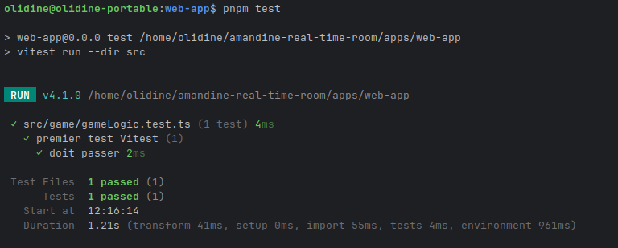
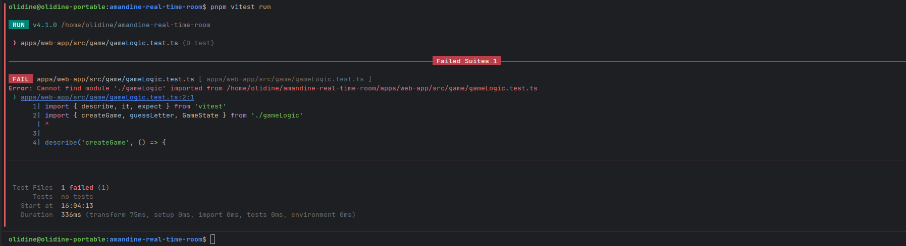
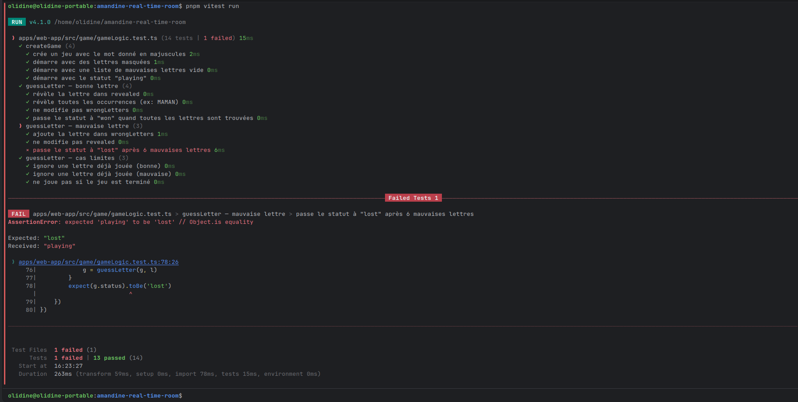
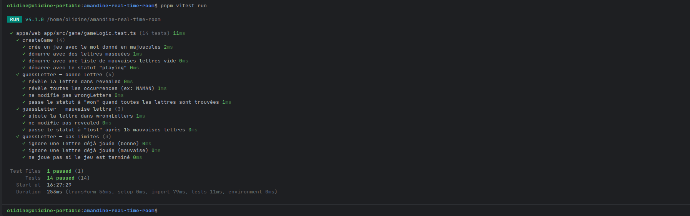

# amandine-real-time-room

## 🔗 Démo
Le projet est en cours de développement.

- [**Web App (Front React)**](https://web-app-5smz.onrender.com/)
- [**Web API (Backend Express)**](https://web-api-5acp.onrender.com)
- [**Health check**](https://web-api-5acp.onrender.com/health)

---

## 🎥 Présentation Vidéo
Découvrez le projet en action, de l'installation aux fonctionnalités temps réel :
> **[Regarder la démo Loom du projet](https://www.loom.com/share/af6574b65ba34191bca50b4f0716466f)**

---

## 📋 Description

Ce projet a pour objectif de créer une **application en temps réel** avec une architecture **mono-repo**.

Le focus principal est :

- Mettre en place une **architecture scalable** et maintenable pour le front et le back.
- Créer un environnement de développement **réaliste et sécurisé**.
- Favoriser le travail en groupe et l'intelligence collective.

### Points clés :
* **Frontend :** React (TypeScript), SCSS/BEM, layout asymétrique.
* **Backend :** Express + Socket.IO (TypeScript).
* **DevOps :** Monorepo PNPM, Docker, déploiement automatisé sur Render.
* **Qualité :** Développement du jeu "Mot du jour" en **TDD** avec Vitest.

---

## 📊 Statut des jalons

| Jalon                                       | Statut | Détail                                         |
|---------------------------------------------|--------|------------------------------------------------|
| J1 — Monorepo + Docker + Render + `/health` | ✅ Fait | 2 services déployés sur Render                 |
| J2 — UI mobile-first SCSS/BEM + asymétrie   | ✅ Fait | Grid desktop asymétrique, BEM strict           |
| J2-3 — Socket.IO rooms + sécurité + Swagger | 🟡 Partiel | Socket.IO ✅, Swagger ❌ à faire                 |
| J3 — CI ESLint + docs complètes             | 🟡 Partiel | GitHub Actions, CONTRIBUTING.md ✅, VEILLE.md ✅ |
| Semaine 12 — Jeu Mot du jour + TDD Vitest   | ✅ Fait | 26 tests ✅, logique back séparée ✅              |

---

## 🗂️ Arborescence du projet
```
amandine-real-time-room/
├── apps/
│   ├── web-api/                   ← Backend Express + Socket.IO (TypeScript)
│   │   ├── src/
│   │   │   ├── server.ts          ← routes HTTP + Socket.IO
│   │   │   ├── wordOfTheDay.ts    ← logique du mot du jour (côté serveur)
│   │   │   └── wordOfTheDay.test.ts
│   │   └── Dockerfile
│   └── web-app/                   ← Front React + Vite + SCSS
│       ├── src/
│       │   ├── App.tsx            ← orchestrateur : gère le socket et les vues
│       │   ├── JoinRoom.tsx       ← formulaire pseudo + room + règles du jeu
│       │   ├── ChatRoom.tsx       ← affichage messages + zone de jeu
│       │   ├── game/
│       │   │   ├── gameLogic.ts       ← logique pure du jeu (état, révélation, erreurs)
│       │   │   ├── gameLogic.test.ts  ← 14 tests unitaires
│       │   │   ├── WordGame.tsx       ← composant React du jeu
│       │   │   └── WordGame.test.tsx  ← 8 tests composant
│       │   ├── setupTests.ts      ← configuration @testing-library/jest-dom
│       │   └── styles/
│       │       ├── main.scss
│       │       ├── _variables.scss
│       │       └── components/
│       │           ├── _join.scss
│       │           └── _chat.scss  ← inclut les styles .word-game
│       ├── nginx.conf
│       ├── vitest.config.ts       ← config vitest avec jsdom + setupFiles
│       └── Dockerfile
├── vitest.config.ts               ← config racine avec projects workspace
├── package.json
├── pnpm-workspace.yaml
├── render.yaml
└── README.md
```

### Schéma de flux
```
Navigateur
    │ HTTP / WebSocket
    ▼
web-app (Render) — React + Nginx
    │
    ├── /api/*             → HTTP      → web-api :3000
    ├── /socket.io/        → WebSocket → web-api :3000
    └── /word-of-the-day   → HTTP      → web-api :3000
```

---

## ⚙️ Stack technique

| Technologie | Rôle |
|------------|------|
| **React + TypeScript** | Frontend interactif |
| **Express + TypeScript** | Backend REST |
| **Socket.IO** | Communication temps réel (rooms, messages) |
| **SCSS + BEM** | Styles structurés, convention de nommage CSS |
| **PNPM** | Gestion des dépendances et workspace mono-repo |
| **Nginx** | Serveur web + reverse proxy (front → back) |
| **Docker** | Conteneurisation des 2 services (multi-stage) |
| **Render** | Hébergement cloud (Blueprint via render.yaml) |
| **Helmet** | Headers de sécurité HTTP automatiques |
| **express-rate-limit** | Protection contre les attaques DoS |
| **ESLint** | Linter pour garantir la qualité du code |
| **Vite** | Build tool et dev server pour le frontend |
| **Vitest + Testing Library** | Tests unitaires et composants (TDD) |

---

## 🎮 Jeu du Mot du jour

Le jeu est intégré dans la zone de jeu de `ChatRoom`. Il cible les enfants d'environ 5 ans.

### Règles

- Le serveur choisit un mot du jour (identique pour tous les joueurs de la journée).
- Le joueur clique sur des lettres pour deviner le mot.
- Une bonne lettre s'affiche dans le mot.
- Une mauvaise lettre va dans la **zone interdite** 🚫
- 15 erreurs = partie perdue.

### Architecture TDD

Le jeu a été développé en **Test-Driven Development** :
```
gameLogic.test.ts  →  (RED)    tests écrits en premier
gameLogic.ts       →  (GREEN)  logique implémentée
WordGame.test.tsx  →  (RED)    tests composant écrits
WordGame.tsx       →  (GREEN)  composant implémenté
```

### Séparation back / front

| Fichier | Où | Rôle |
|---|---|---|
| `WORDS` + `getWordOfTheDay()` | `web-api/src/wordOfTheDay.ts` | Sélection sécurisée du mot (le client ne connaît pas les autres mots) |
| `GET /word-of-the-day` | `web-api/src/server.ts` | Expose le mot du jour via HTTP |
| `gameLogic.ts` | `web-app/src/game/` | État local du jeu (révélation, erreurs, statut) |
| `WordGame.tsx` | `web-app/src/game/` | UI + fetch du mot |

### Sons

Les sons sont générés via l'**API Web Audio** (sans fichiers externes) :

- ✅ Bonne lettre → son aigu court
- ❌ Mauvaise lettre → son grave
- 🎉 Victoire → son montant
- 😢 Défaite → son descendant

---

### Architecture TDD & Tests
Le jeu a été développé selon le cycle **Red-Green-Refactor** :

1. **Initialisation de Vitest** :
   

2. **Premier test échoué (RED)** :
   
   

3. **Tests qui passent (GREEN)** :
   

## 🧪 Tests
```bash
# Lancer tous les tests
pnpm vitest run

# Avec couverture
pnpm vitest run --coverage
```

### Résultats actuels

| Suite | Tests | Statut |
|-------|-------|--------|
| `wordOfTheDay.test.ts` | 4 | ✅ |
| `gameLogic.test.ts` | 14 | ✅ |
| `WordGame.test.tsx` | 8 | ✅ |
| **Total** | **26** | ✅ |

### Configuration

- **Racine** : `vitest.config.ts` avec `projects` pointant vers chaque workspace
- **web-app** : `vitest.config.ts` avec `environment: 'jsdom'` + `setupFiles` pour `@testing-library/jest-dom`
- **web-api** : hérite de la config racine (pas de DOM nécessaire)

---

## 🏗️ Architecture et workflow

### 1. Mono-repo PNPM — Pourquoi ?

Un monorepo regroupe plusieurs packages dans un seul dépôt Git. Les avantages ici :

- **Dépendances mutualisées** : pnpm installe React, TypeScript, etc. une seule fois dans `node_modules` à la racine.
- **Scripts unifiés** : `pnpm dev` au root lance front et back simultanément.
- **Cohérence** : une seule version de TypeScript, un seul ESLint pour tout le projet.
- **Tests centralisés** : `pnpm vitest run` à la racine lance tous les tests de tous les packages.

### 2. Frontend (`web-app`)

- Créé avec **Vite + React + TypeScript**
- SCSS/BEM : convention de nommage (`.join__card`, `.chat__msg--own`, `.word-game__key--wrong`)
- Layout **mobile-first** : flex colonne sur mobile, layout asymétrique sur desktop
- Linting avec **ESLint + React plugin**

### 3. Backend (`web-api`)

- **Express + Socket.IO + TypeScript**
- Sécurité : Helmet (headers HTTP) + rate-limit (429 au-delà de 100 req/min)
- Stockage en mémoire (`Map`) — pas de base de données
- Routes : `/health`, `/word-of-the-day`
- Logique du mot du jour isolée dans `wordOfTheDay.ts` (testable indépendamment)

### 4. Nginx — Pourquoi ?

Nginx est un serveur web et reverse proxy. Il reçoit les requêtes HTTP/WebSocket du navigateur et les redirige vers le bon service :

- Requêtes vers `/api/*` → forward vers le service web-api
- Requêtes vers `/socket.io/` → forward vers web-api avec upgrade WebSocket
- Tout le reste → sert les fichiers statiques React

---

## 🚀 Installation & lancement
```bash
# Cloner le projet
git clone https://github.com/2025-10-CDA-ECO-P6/amandine-real-time-room.git
cd amandine-real-time-room

# Installer toutes les dépendances
pnpm install

# Lancer front et back en parallèle
pnpm dev
```

Le front tourne sur `http://localhost:5173`, le back sur `http://localhost:3000`.

### Variables d'environnement

| Variable | Où | Valeur par défaut | Description |
|----------|----|-------------------|-------------|
| `PORT` | web-api | `3000` | Port du serveur Express |
| `CLIENT_URL` | web-api | `*` | Origine autorisée pour CORS |
| `VITE_API_URL` | web-app | `http://localhost:3000` | URL du back (vide en prod via Nginx) |

---

## 🐳 Docker
```bash
# Front
docker build -f apps/web-app/Dockerfile -t image-app-real-time-room .
docker run -d -p 80:80 --name app-real-time-room image-app-real-time-room

# Back
docker build -f apps/web-api/Dockerfile -t image-api-real-time-room .
docker run -d -p 3030:3000 --name api-real-time-room image-api-real-time-room
```

---

## ☁️ Déploiement Render

Le fichier `render.yaml` (Blueprint) décrit les 2 services Render en code et permet de recréer tout l'environnement de production en un clic.

---

## ⚡ Socket.IO — Événements implémentés

| Événement | Direction | Payload | Description |
|-----------|-----------|---------|-------------|
| `join-room` | Client → Serveur | `{ pseudo, room }` | Rejoindre une room |
| `send-message` | Client → Serveur | `{ content }` | Envoyer un message |
| `new-message` | Serveur → Room | `{ pseudo, content, timestamp }` | Broadcast d'un message |
| `user-joined` | Serveur → Room | `{ pseudo }` | Notification d'arrivée |
| `user-left` | Serveur → Room | `{ pseudo }` | Notification de départ |

---

## 🔒 Sécurité

- **Helmet** : headers HTTP de sécurité (X-Frame-Options, CSP, etc.)
- **Rate Limiting** : 100 req/min par IP, retourne `429` au-delà
- **Validation des entrées** : pseudo (max 20 chars), room (max 30 chars), message (max 500 chars)
- **Mot du jour côté serveur** : la liste complète des mots n'est jamais exposée au client

---

## ✅ Ce qui reste à faire

- [ ] **Swagger / OpenAPI** : documenter `/word-of-the-day` et les événements Socket.IO
- [ ] **GitHub Actions CI** : workflow ESLint + Vitest sur chaque push/PR

---

## 🚀 Évolutions futures : Mode Multijoueur 🏆
Une version multijoueur est actuellement en réflexion sur une branche expérimentale :

- **Le tour par tour** : Chaque joueur de la room propose une lettre à son tour.
- **Le bonus de réussite** : Tant qu'un joueur trouve une bonne lettre, il garde la main. En cas d'erreur, le tour passe au suivant.
- **Condition de victoire** : Le joueur qui tape la dernière lettre manquante gagne la partie pour toute la room.

---

## Liens Docs

[CONTRIBUTING.md](docs/CONTRIBUTING.md)

[VEILLE.md](docs/VEILLE.md)

---

## 👤 Contact

**Amandine** – Développeuse

[](https://github.com/amandinekemp)
[](https://www.linkedin.com/in/amandinedelbouve/)
